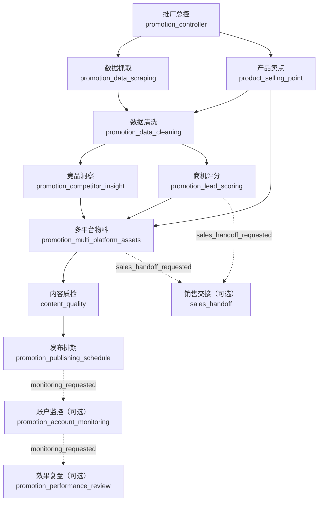

# 企业推广 Agent Team 工作流

本文面向开发、测试和产品验收。企业推广工作流是可持久化的 DAG，不是把多个角色名称拼入一段提示词。

## 目录

- [三个概念不要混淆](#三个概念不要混淆)
- [DAG、依赖与并行](#dag依赖与并行)
- [结果、Artifact 与证据](#结果artifact-与证据)
- [状态与安全生命周期](#状态与安全生命周期)
- [人工边界](#人工边界)
- [操作与扩展](#操作与扩展)
- [验收清单](#验收清单)
- [排障](#排障)

## 三个概念不要混淆

| 概念                 | 含义                                                                                                | 是否代表多 Agent 已实际执行                                                                                     |
| -------------------- | --------------------------------------------------------------------------------------------------- | --------------------------------------------------------------------------------------------------------------- |
| 单 Agent Cowork 聊天 | 当前 Cowork 回合按所选或自动路由的角色责任回答。                                                    | 否；角色路由只影响当前回答。没有对应 Workflow Event 或子会话事件时，不能声称其他角色已经执行。                  |
| 推广工作流           | `PROMOTION_WORKFLOW_GRAPH` 定义的持久化任务图；run、task、事件、尝试和 Artifact 保存在本地 SQLite。 | 是；只有任务实际调度并留下状态/事件，才算已执行。                                                               |
| OpenClaw 子会话      | 可选 Cowork/OpenClaw 运行时会话，可通过 `workflowRunId`、`taskId`、`role` 关联工作流任务。          | 仅当会话确实存在。当前推广图所有节点均为 `inline`；`child_session` 适配器会报“尚不支持”，不能视为默认执行路径。 |

聊天需要完整推广计划、批量获客或持续监控时，应引导到工作流页启动 run；聊天上下文不是 DAG 的执行凭据。

## DAG、依赖与并行

实线为默认节点；虚线为可选节点。销售交接在 `sales_handoff_requested` 启用；监控与复盘在 `monitoring_requested` 启用。完整模式启用两者，核心模式不启用可选节点。调度并发上限为 3。



所有节点当前以 `inline` 执行；前置任务必须为 `completed` 且非 `stale` 才可进入 `ready`。下列字段名来自角色合同，未列出的内容不应被假定为稳定接口。

| 角色（节点）     | 直接依赖                     | 并行关系            | 经校验的 `outputs` 字段                                                           |
| ---------------- | ---------------------------- | ------------------- | --------------------------------------------------------------------------------- |
| 推广总控         | 无                           | 起点                | `controlPlan`、`priorityTasks`、`riskNotes`                                       |
| 数据抓取         | 推广总控                     | 与产品卖点并行      | `items`                                                                           |
| 产品卖点         | 推广总控                     | 与数据抓取并行      | `sellingPoints`                                                                   |
| 数据清洗         | 数据抓取、产品卖点           | 等待两者            | `records`、`duplicates`、`missingFields`                                          |
| 竞品洞察         | 数据清洗                     | 与商机评分并行      | `competitorInsights`                                                              |
| 商机评分         | 数据清洗                     | 与竞品洞察并行      | `leads`                                                                           |
| 多平台物料       | 产品卖点、竞品洞察、商机评分 | 等待三者            | `assets`                                                                          |
| 内容质检         | 多平台物料                   | 串行                | `riskLevel`、`blockingIssues`、`warnings`、`requiredRevisions`、`canArchive`      |
| 发布排期         | 内容质检                     | 串行                | `publicationDrafts`（`manualReviewRequired: true`）                               |
| 销售交接（可选） | 商机评分、多平台物料         | 可与质检/排期链并行 | `handoffDraft`（`manualReviewRequired: true`）                                    |
| 账户监控（可选） | 发布排期                     | 等待排期            | `metrics`、`anomalies`、`hypotheses`、`adjustmentActions`                         |
| 效果复盘（可选） | 账户监控                     | 串行                | `reviewSummary`、`effectiveStrategies`、`improvementActions`、`proposedKnowledge` |

并行只表示依赖满足且未超过并发上限，不表示 Cowork 角色自动变成独立子会话。

## 结果、Artifact 与证据

### 任务结果和 lineage

每个角色返回结构化 `PromotionTaskResult`：

```text
role, status, summary, outputs, missingInfo, todos, risks,
handoffContext, artifactRefs
```

`artifactRefs` 的字段为：

```text
id, kind, schemaVersion, summary, producerTaskId, evidenceIds
```

调度器将本任务已有引用与所有上游引用去重，作为下一任务的 `inputArtifacts`。任务完成或进入 `awaiting_approval` 时，系统持久化一个 Artifact：

```text
id, runId, taskId, kind, schemaVersion, payload, evidenceIds, createdAt
```

其 `payload` 为角色校验后的 `outputs`；监控任务还保留 `scheduledPromotionMonitoring` 输入。新 Artifact 引用追加到该任务 lineage，供下游使用；任务卡展示输入/输出引用。

### 证据要求

- 角色输出先经过角色级合同校验；结构不匹配或缺少必填项，不能作为完成结果。
- 抓取项必须有 HTTP(S) `sourceUrl`、可解析 `capturedAt` 和有效 `confidence`，这是可回查来源的最低要求。
- 引用必须指向同一 run、由声明 `producerTaskId` 产生、且已在本任务输入 lineage 中的 Artifact；不能引用自身或凭空声明 ID。校验失败时任务转为 `needs_input`，要求补充已验证 Artifact。
- `evidenceIds` 是 Artifact 和引用中的证据 ID 列表。监控指标可以携带它，但指标可用性还取决于有效渠道、来源、时间与窗口；不要以空证据掩盖缺失信息。
- 不要在 summary、Artifact、事件或文档中写 token、密码、Webhook 密钥等原始机密。

## 状态与安全生命周期

| 层级 | 状态                                                   | 含义和处理                                   |
| ---- | ------------------------------------------------------ | -------------------------------------------- |
| run  | `draft`、`running`                                     | 已创建/正在调度；仅依赖满足的任务可启动。    |
| run  | `needs_input`、`awaiting_approval`                     | 有任务缺输入或等待人工决定；先处理暂停条件。 |
| run  | `blocked`、`error`                                     | 有阻断或执行失败；`error` 可重试。           |
| run  | `completed`、`cancelled`、`archived`                   | 终态；归档后不可恢复执行。                   |
| task | `waiting`、`ready`、`running`                          | 等待依赖、可调度、执行中。                   |
| task | `needs_input`、`awaiting_approval`、`blocked`、`error` | 暂停或失败，run 映射为相应状态。             |
| task | `completed`、`stale`、`cancelled`                      | 成功有效、因上游变更需重算、或取消前未完成。 |

- **恢复**：未归档且非完成/取消的 run 可恢复；仍有 `needs_input` 或 `awaiting_approval` 时会安全停住。
- **重试**：界面的“重试”复用恢复入口。`error` run 先记录 `run_retrying` 再调度；任务重试会新增 attempt，不删除历史。
- **退回与重跑**：审批退回把待审任务设为 `stale`，记录 `approval_rejected` 与反馈。重跑推广任务会将其 DAG 下游设为 `stale`，不影响无关上游。
- **取消**：所有未完成任务变为 `cancelled`，已完成任务不变；已有 Artifact、事件与 attempt 保留。
- **归档**：仅 `completed` 且无阻断风险审查的 run 可归档。归档后只读，不能恢复或继续创建 Artifact。

### 重启恢复

run snapshot、任务、Artifact、事件和 attempt 都保存在 SQLite。重启后恢复时，原 `running` 且没有 attempt 的任务回到 `ready`；有 attempt 的中断任务变为 `error`，对应 attempt 以“进程重启中断”结束。随后由用户决定恢复/重试，不能把中断误报为完成。

## 人工边界

- **草稿优先**：多平台物料、发布排期和销售交接均为草稿或人工待办；本工作流不保证、更不宣称已经外部发布、发送消息、创建 CRM 记录或提交 PR。
- **高风险与审批**：内容质检的 `riskLevel: high` 会归一为 `canArchive: false`，因此不能归档。要暂停为人工审批，任务结果还必须明确返回 `awaiting_approval`；当前实现不会只凭风险等级自动改写任务状态。批准后需恢复 run，才会继续调度下游；退回必须有反馈并允许重算。
- **监控**：定时监控只接收/整理提供的指标快照，输出报告、异常、假设与调整建议；它是只读、建议性路径，不改投放、预算或账号。
- **知识**：复盘的 `proposedKnowledge` 非空时任务变为 `awaiting_approval`；仅人工批准才持久化候选知识，拒绝则不写入。
- **外部连接**：平台设置的 endpoint、token、appId 仅用于配置和就绪校验；“已配置”不等于“已发布”。

## 操作与扩展

### 重试、恢复、取消、归档

1. 导入资料后进入“工作流”，输入目标并选择核心或完整模式；完整模式请求销售交接与监控/复盘可选节点。
2. 在任务卡查看状态、风险、待办及 Artifact。补齐 `needs_input` 后点击“恢复”；`awaiting_approval` 在任务卡批准或退回，批准后再点击“恢复”以继续下游。
3. `error` run 点击“重试”；`running`、`needs_input`、`awaiting_approval`、`blocked` 可点击“恢复”，但未解除暂停条件不会被越过。
4. 需要停止时点击“取消”。完成且无阻断风险审查后，在运行记录中归档；归档不是取消或重试。

### 增加一个推广角色

在工作空间新增/绑定 Agent 只影响 Cowork/工作空间配置，**不会**自动进入推广 DAG。新增可调度推广角色至少需要：

1. 在 `src/shared/enterpriseLeadWorkspace/constants.ts` 增加角色 ID；需要展示分组时同步改 `agentOrganization.ts` 和中英文 i18n。
2. 在 `promotionTaskContracts.ts` 增加唯一 `outputs` 合同、解析/归一化和测试；不要把未校验自由文本当正式交接。
3. 在 `promotionWorkflowGraph.ts` 增加节点、精确 `dependsOn`、可选条件；保持无环并检查最多 3 个并发任务下的依赖。
4. 更新提示词/系统模板、Artifact kind 映射和工作空间绑定，并覆盖依赖、并行、失败/重试、lineage 与审批测试。
5. 如需子会话，必须实现并验证 `ChildSessionWorkflowExecutionAdapter`；不能只把 `executionMode` 改为 `child_session`。

### 增加一个平台输出适配器

当前平台输出是配置模型和草稿交付边界，不是既有自动发布器。新增平台时：

1. 在 `constants.ts` 的平台 ID/交付模式中增加稳定 ID，并在 `validation.ts` 提供默认值和归一化。
2. 更新设置就绪校验、设置 UI 和中英文文案；沿用已有 `id`、`enabled`、`deliveryMode`、`account`、`endpoint`、`token`、`appId`、`payloadFormat`，不把密钥写入 Artifact。
3. 为草稿转换/导出定义可测试输入、输出和失败行为；风险审查必须先完成，保留 `manualReviewRequired` 与人工待办。
4. 若未来确需外部 API，单独设计受确认的外部动作边界、最小权限和审计；本文不把它视为已具备能力。

### 查看事件、尝试和子会话

- **事件与尝试**：工作流页“历史时间线”读取当前 run 最近事件和 attempts（每类最多 200 条）。事件按 `sequence` 排序；界面展示事件标签、审批退回反馈和 attempt 序号/状态。为了避免泄露运行时细节，渲染层不会展示原始 role、摘要、错误或 payload；需要完整审计时在主进程通过 `WorkflowArtifactStore.listEvents(runId)` 和 `listRecentRunAttempts(runId, limit)` 查询。
- **Artifact**：任务卡展示 `WorkflowArtifactRef`；开发排查用 `WorkflowArtifactStore.listRunArtifacts(runId)` 查询完整持久化 Artifact。
- **子会话**：先从父 Cowork 会话子会话列表查看 `workflowRunId`、`taskId`、`role`，再调用 `window.electron.cowork.getWorkflowTaskSubagentSession({ parentSessionId, workflowRunId, taskId })` 精确查询。没有关联记录，就没有可验证的子会话。

## 验收清单

以下 12 项是端到端验收场景，不是对外发布承诺：

- [ ] 创建企业推广工作空间并导入资料。
- [ ] 输入“找到本周机械设备客户并生成首周推广内容”。
- [ ] 推广总控创建 run，数据抓取和产品卖点并行。
- [ ] 数据清洗完成后，竞品洞察和商机评分并行。
- [ ] 多平台物料生成后进入内容质检。
- [ ] 质检发现高风险表达时，`canArchive` 为 `false` 且 run 不能归档；当任务结果明确为 `awaiting_approval` 时，run 进入审批暂停。
- [ ] 退回或重跑物料后，仅物料依赖链及其下游为 `stale`，无关上游不失效。
- [ ] 批准草稿并恢复 run 后，生成发布排期和人工发布待办，而不是自动外发。
- [ ] 定时监控生成指标报告；缺少已验证指标时转为 `needs_input`。
- [ ] 复盘 Agent 生成下一轮策略建议；候选知识需人工确认后才写入。
- [ ] 重启应用后，能从 run snapshot 恢复状态；中断 attempt 不得显示为完成。
- [ ] 取消 run 后，未完成任务停止，已生成 Artifact 保留。

## 排障

| 现象                                 | 检查与处理                                                                                                                                                                                                                |
| ------------------------------------ | ------------------------------------------------------------------------------------------------------------------------------------------------------------------------------------------------------------------------- |
| 监控为 `needs_input` 或无报告        | 检查 `metricSource` 的 `channel`、`accountName`、`capturedAt`、`impressions`、`clicks`、`interactions`、`leads`、`cost`，以及 `sourceId`、`periodStart`、`periodEnd` 和窗口。渠道须为已知平台，窗口不能倒置；补齐后恢复。 |
| 定时监控重复或陈旧                   | 同一 run/task/window 的监控 claim 会判重复。检查 `runId`、任务、窗口与幂等键；新数据应提供新窗口，不删除审计记录。                                                                                                        |
| 审批不可用或不生效                   | 仅 `awaiting_approval` 任务可批准/退回；退回反馈必须非空且不超过 2,000 字符。批准后再恢复。复盘含 `proposedKnowledge` 也会等待批准。                                                                                      |
| 子 Agent 找不到                      | 推广节点默认不启动子会话。检查 `executionMode`、`handoffContext.childSessionId`（若有）及父会话记录；无记录时按 inline 事件解释，不要声称子 Agent 已运行。                                                                |
| `better-sqlite3` 原生模块/ABI 不匹配 | 使用 Node.js `>=24.15.0 <25`。在根目录运行 `npm rebuild better-sqlite3` 后再 `npm test`（其 `pretest` 也会重建）。Electron 仍不匹配时走 `npm run electron:dev` 的项目编译路径，不复制其他 Node/Electron 版本二进制。      |

## 验证命令

文档改动本身无需 TypeScript lint；涉及实现时按仓库约定执行：

```bash
npm test
npx eslint --ext ts,tsx --report-unused-disable-directives --max-warnings 0 <touched-files>
npm run compile:electron
npm run build
```

首次构建/同步 OpenClaw 运行时用 `npm run electron:dev:openclaw`；运行时已存在后的日常手工验证用 `npm run electron:dev`。不要在命令、日志截图或文档中暴露密钥。
